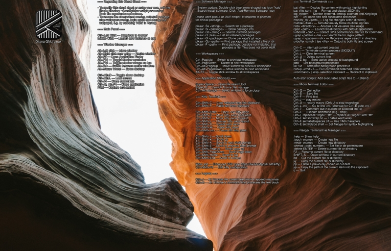

# xfce-wallpaper-overlay

Automatically overlay text and images on XFCE wallpapers.

## Description

`xfce-wallpaper-overlay` is a utility that allows you to dynamically add text or image overlays to your XFCE desktop wallpaper. It runs in the background and automatically updates the wallpaper whenever the original wallpaper changes or when the overlay configuration files are modified.



*Screenshot: An example of xfce-wallpaper-overlay in action, showing text and image overlays on an XFCE wallpaper. Thanks to [Jasper Gribble](https://unsplash.com/@jaspergribble) for the background image.*

Note that above sample is scaled. The font size is automatically determined based on the longest line contained in the text files.
Here’s an enlarged crop where you can see the font rendering which allows for good readability on both bright and dark backgrounds:


## Features

- Automatically detects changes in wallpaper and overlay configuration
- Supports both text and image overlays
- Adjusts text color based on wallpaper brightness for optimal readability
- Handles multiple displays, focusing on the primary XFCE display
- Preserves original wallpaper scaling settings
- Does not modify the original image file

## Installation

This package is available in the Ditana Arch Repository and is installed by default for desktop installations of Ditana GNU/Linux.

## Configuration

The overlay content is configured through files placed in the `~/.config/xfce-wallpaper-overlay` directory. Each file in this directory represents a column on the wallpaper.

### Text Overlay

To display text, create a file with the desired content. The text will be rendered in the corresponding column on the wallpaper.

**Note:** Use line breaks in your text files as no word wrapping is performed. The font size is determined by the longest line.

### Image Overlay

To display an image, create a file with the following content:

```
/path/to/image.png[:percentage]
```

Where:
- `/path/to/image.png` is the full path to the image file
- `percentage` (optional) is the width of the image relative to the column width (default is 100)

## Examples

1. To display text in the first column:
   ```
   echo "Hello, World!" > ~/.config/xfce-wallpaper-overlay/column1.txt
   ```

2. To display an image in the second column, occupying 50% of the column width:
   ```
   echo "/usr/share/pixmaps/logo.png:50" > ~/.config/xfce-wallpaper-overlay/column2.txt
   ```

## Usage with Ditana GNU/Linux

In Ditana GNU/Linux, this package is used in conjunction with [ditana-config-xfce](https://github.com/acrion/ditana-config-xfce) to display a Ditana-specific cheat sheet on the desktop wallpaper.

## Notes

- The overlay is applied each time the wallpaper changes or when configuration files are modified.
- To remove the overlay, uninstall the xfce-wallpaper-overlay package, log out and back in, then change the wallpaper.

## Dependencies

- fontconfig
- imagemagick
- inotify-tools
- xfconf
- xmlstarlet

## Author

Stefan Zipproth <s.zipproth@ditana.org>

For more information about Ditana GNU/Linux, visit [https://ditana.org](https://ditana.org)
